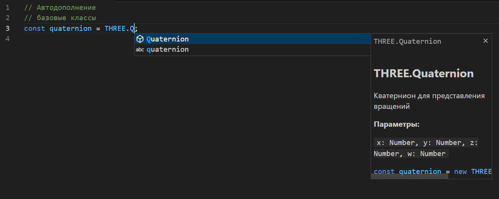

# Three.js Autocomplete 🤩 v0.0.3

⏩ Это расширение предоставляет автодополнение для Three.js, упрощая разработку 3D-приложений.

## Возможности
- Автодополнение для 15 классов:
    * Поддержка основных классов Three.js, таких как:
    * Scene
    * Vector2, Vector3
    * Quaternion
    * BoxGeometry, SphereGeometry, PlaneGeometry
    * MeshBasicMaterial, MeshStandardMaterial
    * PerspectiveCamera, WebGLRenderer И другие!
- Сниппеты: 
    * быстрая вставка через сниппеты. Например: const vector = new THREE.Vector2(${1:x}, ${2:y});
- Поддержка языков: 
    * Работает с JavaScript, TypeScript, JSX и TSX.
- Интеллектуальное распознавание контекста: 
    * предложение появляются только после ввода THREE.*.
- Документация: 
    * Подробные описания и документация для элементов Three.js.

# Скриншоты

⚡ Расширение предлагает 15 доступных классов библиотеки THREEJS


📚 Подсказки включают описание, параметры и примеры использования - будет дорабатываться в будущих обновлениях

## Установка
1. Установите расширение через Visual Studio Code Marketplace.
2. Начните вводить код, и автодополнение появится автоматически.

## Использование
### Базовое автодополнение
Введите `THREE.` и выберите нужный класс или свойство из списка:

```javascript
const scene = new THREE.Scene(); 
```
### Сниппеты
Используйте сниппеты для быстрого создания объектов:
```javascript
// 1. Создание двухмерного вектора
const vector = new THREE. --> Vector2(${1:x}, ${2:y})

// 2. Создание геометрии параллелепипеда
const box = new THREE. --> BoxGeometry(${1:width}, ${2:height}, ${3:depth})

// 3. Создание сферической геометрии
const sphere = new THREE. --> SphereGeometry(${1:radius}, ${2:widthSegments}, ${3:heightSegments})

// 4. Создание стандартного материала
const material = new THREE. --> MeshStandardMaterial({color: 0x${1:ff0000}, metalness: ${2:0.5}, roughness: ${3:0.5}})

Как использовать сниппеты?
Начните вводить THREE. в редакторе.
Выберите нужный класс (например, Vector2) из списка автодополнения.
После выбора класса нажмите Tab, чтобы вставить сниппет.
Замените заполнители (например, ${1:x}, ${2:y}) на свои значения.

Примечание:
Заполнители ${1:x}, ${2:y} и т.д. — это места, где вы можете ввести свои значения. После вставки сниппета нажмите Tab, чтобы переключаться между заполнителями. 

```
## Официальная документация
[Three.js Manual](https://threejs.org/manual/?spm=a2ty_o01.29997173.0.0.2feec92104AHEk#en/creating-a-scene)

## Лицензия
MIT

## Планы на будущее
- 🔥 Автодополнение методов

### АВТОР
GitHub: https://github.com/Maksim2021-whiteHAKER
Telegram: @not_found_error404_404 (Пожалуйста, укажите "VS CODE" в сообщении для скорого ответа)
Email: ultragf2019@gmail.com

### Поддержите проект
Если вам понравилось это расширение поддержите автора:
* ⭐ Звездочка на GitHub - это всегда приятно
* 💸 Монеткой:
    - YooMoney: 410015336126322
    - Payeer  : Уточняйте реквизиты через Telegram или Email. 